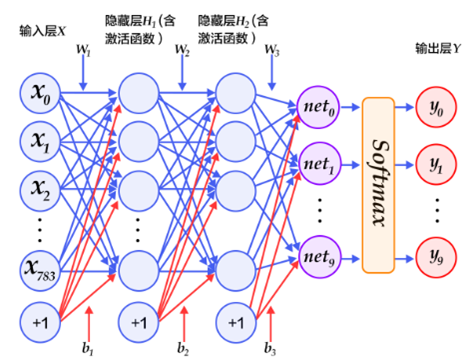
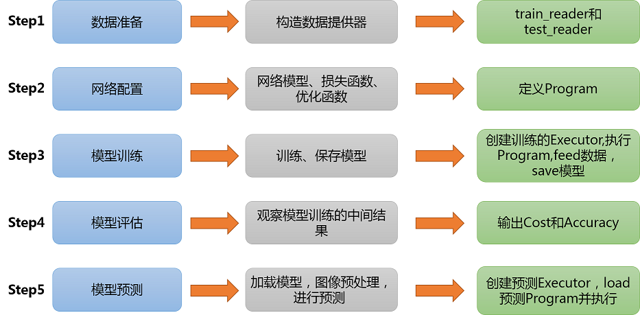
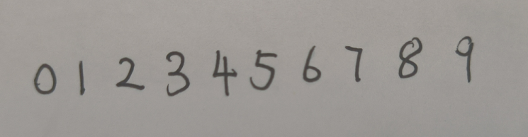
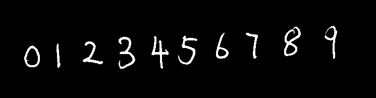
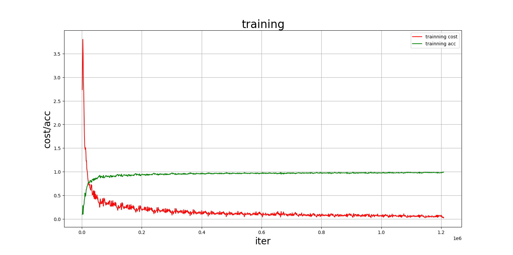
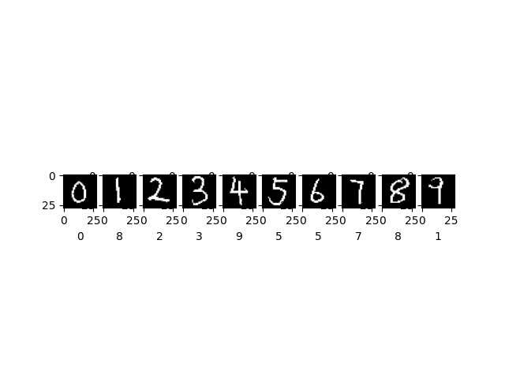

# 机器学习手写数字识别
paddle_minist.py是项目文件

5886318.py是paddle网站的备份代码

images是项目的网络结构图片以及用于预测的手写数字图片

## 运行环境
需要在自己的conda环境中安装百度飞桨的paddle软件包:

pip install paddlepaddle -i https://pypi.tuna.tsinghua.edu.cn/simple

## 原理
本次实验使用含有两个隐藏层的感知机网络。

令人意外的是，只是两层隐藏层的感知机模型，在MINIST数据集上就能达到最高时98%的准确率！！！

本次训练感知机网络如图:

网络搭建流程如图：

用于测试的图片使用自己的手写处理得到。

原手写图片为：

然后将其灰度阈值二值化：

最后得到单张数字图片，大小设为 28*28 用于输入训练好的模型进行预测：

## 实验结果

实验得到最终的准确率为97%。

结果如图：

图一中展示了训练过程中的误差下降趋势，以及训练过程准确率的上升展示。可以看出当训练误差越低，训练准确率逐渐变高。

图二展示了将自己的手写数字输入到网络之后，得到的模型预测结果，可以看到模型在对于手写数字为1，4，9的图片，错误的预测为了8，9，1。其余数字均预测正确。

# 一、实验目的
本实验旨在通过训练一个基于机器学习的模型，实现对手写数字的识别。

学习深度学习的基本原理和方法：通过手写数字识别实验，学习深度学习领域的基本概念和技术，并且尝试使用人工智能最早的模型感知机。处理手写数字识别需要理解图像处理和对图像进行预处理。通过实验，了解图像处理的基本步骤，如灰度化、二值化，归一化等，并学习如何从图像中提取有用的特征。掌握数据集的处理和模型的训练：深度学习模型需要大量的数据进行训练。通过实验，学习如何处理手写数字数据集，包括数据集的划分、数据的加载和预处理等，并使用深度学习框架百度paddle训练模型，优化模型的超参数，提高模型的准确性和泛化能力。

实现手写数字识别：通过感知机模型，实现对手写数字的识别功能。通过测试集的验证和性能评估，评估感知机的准确性、精确度等指标，对感知机的性能进行分析。手写数字识别是机器学习的典型应用，实验通过手写数字识别这一实际应用场景，了解深度学习在实际问题中的应用，并掌握将深度学习技术应用到其他领域的能力。

通过以上实验目的的达成，学生可以全面了解深度学习的基本原理和方法，并具备使用深度学习技术进行实际应用的能力。

# 二、原理分析
多层感知机（Multi-Layer Perceptron, MLP），是一种基本的前馈人工神经网络结构，由输入层、隐藏层和输出层组成。在手写数字识别项目中，输入层通常用于接收表示手写数字的像素值，输出层用于输出对应的数字标签，而隐藏层则负责提取输入层特征并进行非线性映射。

整个手写数字识别过程可以分为以下几个步骤：

1. 数据预处理：本次实验直接调用百度paddle平台的数据集。PaddlePaddle接口提供的数据已经经过了归一化、居中等处理。

2. 特征提取：在感知机的隐藏层中，通过使用一系列的神经元和激活函数，可以对输入的像素值进行非线性映射，提取出更高级别的特征。隐藏层的神经元数目和激活函数的选择是需要进行调试和优化的关键参数。代码中定义一个简单的多层感知器，一共有三层，两个隐层和一个大小为10的输出层，因为MNIST数据集是手写0到9的灰度图像，类别有10个，所以最后的输出大小是10。最后输出层的激活函数是Softmax，所以最后的输出层相当于一个分类器。加上一个输入层的话，多层感知器的结构是：输入层-->>隐层-->>隐层-->>输出层。

3. 模型训练：通过将手写数字图像数据集划分为训练集和验证集，使用反向传播算法（Backpropagation）对感知机模型进行训练。反向传播算法通过计算模型预测结果与实际标签之间的误差，并根据误差值调整模型的权重和偏置，以不断优化模型的预测能力。

4. 模型预测：在模型训练和评估完成后，可以使用测试集对训练好的感知机模型进行预测，识别手写数字图像，并输出对应的数字标签。

# 三、数据处理步骤
手写数字识别数据处理步骤包括以下几个步骤：
## Step1. 准备数据
### (1)数据集介绍
MNIST数据集包含60000个训练集和10000测试数据集。分为图片和标签，图片是28*28的像素矩阵，标签为0~9共10个数字。其数据集如图所示： 
### (2)训练集与测试集处理
利用paddle平台的库函数 paddle.dataset.mnist.train()和test()分别获取mnist训练集和测试集。paddle.reader.shuffle()表示每次缓存BUF_SIZE个数据项，并进行打乱。paddle.batch()表示每BATCH_SIZE组成一个batch。

## Step2.网络配置
### (1)	定义多层感知器
定义一个简单的多层感知器，一共有三层，两个隐层和一个大小为10的输出层，因为MNIST数据集是手写0到9的灰度图像，类别有10个，所以最后的输出大小是10。最后输出层的激活函数是Softmax，所以最后的输出层相当于一个分类器。加上一个输入层的话，多层感知器的结构是：输入层-->>隐层-->>隐层-->>输出层。
### (2)	定义数据层
输入的是图像数据。图像是 28 * 28 的灰度图，所以输入的形状是[1, 28, 28]，如果图像是32*32的彩色图，那么输入的形状是[3. 32, 32]，因为灰度图只有一个通道，而彩色图有RGB三个通道。
### (3)获取分类器
### (4)定义损失函数和准确率
使用交叉熵损失函数，该函数在分类任务上比较常用。定义了一个损失函数之后，对其求平均值，训练程序必须返回平均损失作为第一个返回值，因为它会被后面反向传播算法所用到。同时我们还可以定义一个准确率函数，这个可以在我们训练的时候输出分类的准确率。
### (5)定义优化函数
这次我们使用的是Adam优化方法，同时指定学习率为0.001
## Step3.模型训练 and Step4.模型评估
### （1）创建训练的Executor
首先定义运算场所 fluid.CPUPlace()和 fluid.CUDAPlace(0)分别表示运算场所为CPU和GPU。Executor:接收传入的program，通过run()方法运行program。
### （2）将数据传入网络
告知网络传入的数据分为两部分，第一部分是image值，第二部分是label值。DataFeeder负责将数据提供器（train_reader,test_reader）返回的数据转成一种特殊的数据结构，使其可以输入到Executor中。
### （3）训练并保存模型
训练需要有一个训练程序和一些必要参数，并构建了一个获取训练过程中测试误差的函数。必要参数有executor，program，reader，feeder，fetch_list。executor表示之前创建的执行器。program表示执行器所执行的program是之前创建的program，如果该项参数没有给定的话则默认使用defalut_main_program。reader表示读取到的数据。feeder表示前向输入的变量。fetch_list表示用户想得到的变量。
## Step5.模型预测
### (1)图片预处理
在预测之前，要对图像进行预处理。首先进行灰度阈值二值化，然后压缩图像大小为28*28，接着将图像转换成一维向量，最后再对一维向量进行归一化处理。
### (2) 创建预测用的Executer
### (3)	开始预测
通过fluid.io.load_inference_model，预测器会从params_dirname中读取已经训练好的模型，来对从未遇见过的数据进行预测。
